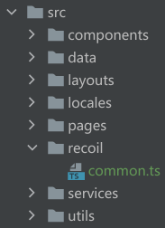

# umi-plugin-recoil

[](https://npmjs.org/package/umi-plugin-recoil) [](https://npmjs.org/package/umi-plugin-recoil)

A plugin for umijs@3.x to help you set `RecoilRoot`.

## What is Recoil?

[Recoil](https://recoiljs.org/) provides a fast and flexible way to share state across components with `React Hooks Api`.

## What does this plugin do?

- [x] Inject `RecoilRoot` to umi root container. So you can use `useRecoilState` in your code without declaring a `RecoilRoot` context.
- [x] Provide an `useRecoilObjState` Api which can shallow merge your object-type state when calling `setState`.
- [ ] list-type state operator
- [ ] history-travel state operator
- [ ] `RecoilRoot` options

## How to use?

### Install dependencies with npm or yarn in you umijs@3 project

```bash
npm install umi-plugin-recoil recoil
# or
yarn add umi-plugin-recoil recoil
```

### Create Recoil Atom in the right place

I am used to place the `Atom` inside 'recoil' folder like this.



### Create Atom

Use `atom` to create a `store` that can be shared across your project.

```javascript
import { atom } from 'recoil';

const myState = atom({
  key: 'myState',
  default: 'val',
});

export default myState;
```

You can also create an object-type `Atom`.

```javascript
import { atom } from 'recoil';

const myObjState = atom({
  key: 'myObjState',
  default: {
    name: 'this is an object',
    value: 123,
  },
});

export default myState;
```

[See more](https://recoiljs.org/docs/basic-tutorial/atoms/)

### Use state in your code

Use `useRecoilState` like `useState` to implicitly subscribe the component to the given state.

```tsx
import React from 'react';
import { useRecoilState } from 'recoil';
import myState from '@/recoil/myState';

export default () => {
  const [state, setState] = useRecoilState(myState);

  return (
    <div>
      <div>{state}</div>
      <button
        onClick={() => {
          setState('clicked');
        }}
      >
        Click
      </button>
    </div>
  );
};
```

[See more](https://recoiljs.org/docs/api-reference/core/useRecoilState/)

### [Special] Merge object-type state when setState

This plugin provides an `useRecoilObjState` Api which allow you subscribe an object-type atom and shallow merge the object when calling `setState`.

You should import the `useRecoilObjState` Api from `umi`;

```tsx
import React from 'react';
import { useRecoilObjState } from 'umi'; // import from umi
import myObjState from '@/recoil/myObjState'; // see above

export default () => {
  const [objState, setObjState] = useRecoilObjState(myObjState);

  return (
    <div>
      <div>{objState.name}</div>
      <div>{objState.value}</div>
      <button
        onClick={() => {
          // objState will change to { name: 'this is an object', value: 888 } ;
          setObjState({
            value: 888,
          });
        }}
      >
        Click
      </button>
    </div>
  );
};
```
